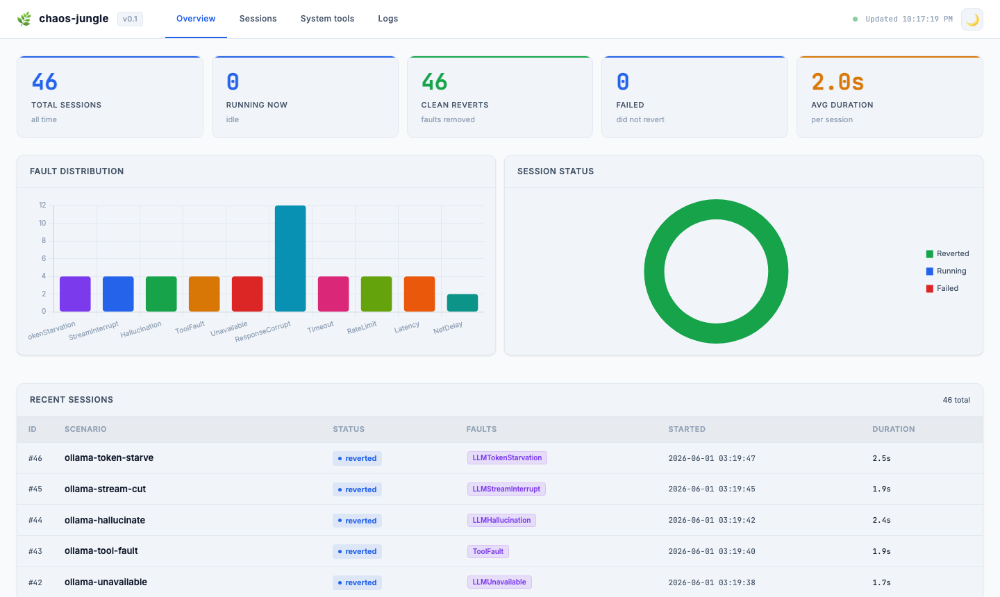
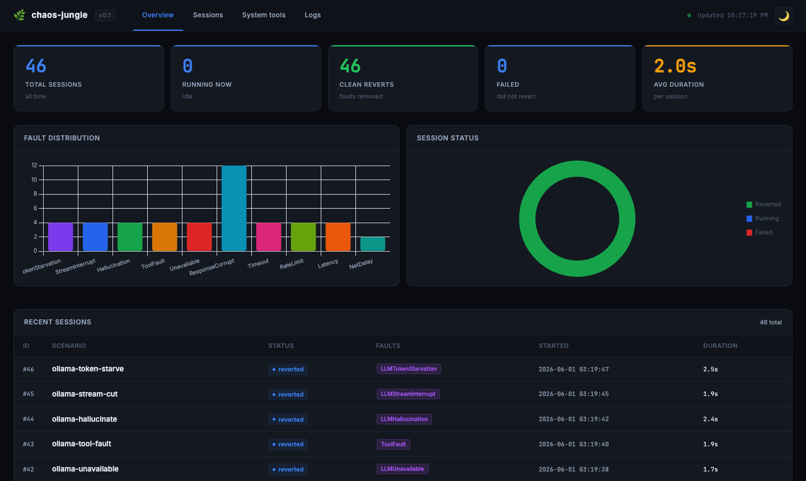
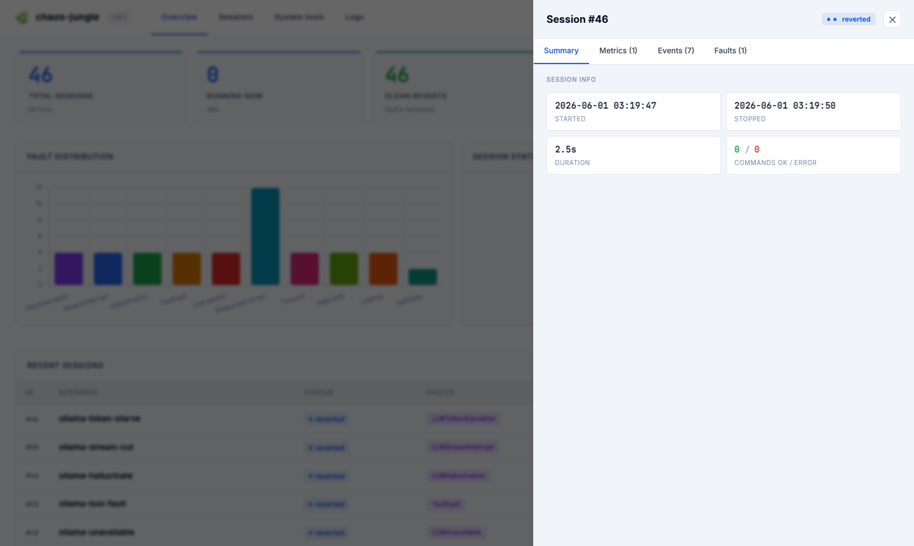

.. _guide-dashboard:

Dashboard
=========

chaos-jungle ships a built-in web dashboard for monitoring experiments in
real-time, reviewing results, and inspecting system state — all without
leaving your browser.

   Dashboard in light mode (default).

   Dashboard in dark mode — toggle with the 🌙 button in the header.

Quick start
-----------

.. code-block:: bash

   chaos-jungle dashboard

Open **http://localhost:8050** in your browser.  The dashboard auto-refreshes
every 6 seconds.

To bind to a different address or port:

.. code-block:: bash

   chaos-jungle dashboard --host 0.0.0.0 --port 9090

Or from Python:

.. code-block:: python

   from chaos_jungle.dashboard import run
   run(host="127.0.0.1", port=8050)

Tabs
----

Overview
~~~~~~~~

The landing tab gives a high-level view of all experiments:

- **KPI cards** — total sessions, running now, clean reverts, failures,
  average duration.
- **Fault distribution chart** — bar chart of how many sessions used each
  fault type (``NetworkDelay``, ``LLMLatency``, etc.).
- **Session status donut** — proportion of reverted / running / failed sessions.
- **Recent sessions** — the last 8 sessions in a clickable table.

Sessions
~~~~~~~~

Full paginated table of all experiment sessions.  Use the search box to
filter by name, fault type, or session ID.  Use the status dropdown to show
only running, reverted, or failed sessions.

Click any row to open the **session detail drawer**.

Scenarios Registry
~~~~~~~~~~~~~~~~~~

Lists every scenario that has been registered in the local
:ref:`guide-registry`.  Open it with the **◎ Scenario Registry** button in
the sidebar (between Skill and System Tools).

.. list-table::
   :header-rows: 1
   :widths: 20 80

   * - Column
     - Description
   * - UUID
     - First 8 characters of the scenario UUID (hover for the full ID)
   * - Name
     - Human-readable scenario name
   * - Type
     - **local** (green) / **ssh** (blue) / **http** (orange)
   * - Target
     - Remote host/IP for SSH and HTTP scenarios; empty for local
   * - Status
     - **pending** (grey) / **running** (animated accent dot) /
       **done** (green) / **failed** (red)
   * - Session
     - Linked session ID once the scenario has completed
   * - Updated
     - Timestamp of the last status change

Use the **Status** and **Type** dropdowns to filter the list.  Click
**Refresh** to reload the registry without a full page reload.

The KPI bar shows scenario counts by state — useful for watching a batch of
parallel remote experiments in progress.

System tools
~~~~~~~~~~~~

Shows which system dependencies are installed on the machine running the
dashboard server:

.. list-table::
   :header-rows: 1
   :widths: 15 20 65

   * - Binary
     - Package
     - Used for
   * - ``tc``
     - iproute2
     - Network fault injection (``NetworkDelay``, ``NetworkLoss``, etc.)
   * - ``ip``
     - iproute2
     - Network interface auto-detection
   * - ``filefrag``
     - e2fsprogs
     - Storage fault — extent info
   * - ``dd``
     - coreutils
     - Storage fault — bit-flip writes; ``DiskFull``
   * - ``inotifywait``
     - inotify-tools
     - Storage fault — file watch
   * - ``python3``
     - python3
     - Storage / BPF scripts
   * - ``ssh``
     - openssh-client
     - SSH target support
   * - ``stress-ng``
     - stress-ng
     - ``CPUStress``, ``MemoryStress``, ``IOStress``
   * - ``docker``
     - docker-ce / docker.io
     - ``ContainerKill`` — pause, stop, kill, rm containers
   * - ``systemctl``
     - systemd
     - ``ServiceFault`` — stop, restart, kill, mask services
   * - ``pkill`` / ``pgrep``
     - procps
     - ``ProcessKill`` — pattern-match and signal processes

A green dot means the binary is found; red means it is missing (the
corresponding fault type will fail preflight).

Logs
~~~~

Live tail of log files under ``~/.chaos-jungle/``.  Select a file from
the dropdown; the last 150 lines are shown with colour-coded severity:

- **Red** — ERROR / FAIL
- **Yellow** — WARN / CORRUPT
- **Green** — REVERT / stop / OK
- **Grey** — everything else

   Session detail drawer — click any row to open it.

Session detail drawer
---------------------

Click any session row to open a slide-in drawer with four inner tabs.

Summary
~~~~~~~

- Started / stopped timestamps and wall-clock duration.
- Command OK / Error count from the event log.
- Active ``tc qdisc`` rules (confirms network faults are still injected).
- Storage bit-flip table from ``cj.db`` (file, block offset, before/after
  hex values).

Metrics
~~~~~~~

Shows metric results recorded via
:func:`~chaos_jungle.runner.ChaosRunner.record_result`.

When a result contains ``baseline_*`` / ``chaos_*`` / ``delta_*`` keys
(produced automatically by ``@chaos_measure`` or the Ollama test script),
the drawer renders a **comparison table**:

.. list-table::
   :header-rows: 1
   :widths: 30 15 15 40

   * - Metric
     - Baseline
     - Chaos
     - Delta
   * - ``ollama tokens_per_s``
     - 85.3
     - 12.1
     - −73.2 (−86%) ↓ red bar
   * - ``ollama total_duration_s``
     - 1.18
     - 4.53
     - +3.35 (+284%) ↑ green bar

The inline delta bar fills proportionally to the relative change.  The
colour logic is context-aware: for *throughput / rate / count* metrics,
a decrease is highlighted red (worse); for *latency / duration* metrics,
an increase is red.

Any keys that don't match the ``baseline_/chaos_/delta_`` pattern are
displayed as plain value tiles below the comparison table.

Events
~~~~~~

Full event log rendered as an icon-tagged timeline:

- **✓ green** — start / stop / revert / OK events
- **✕ red** — ERROR events
- **! yellow** — WARN events
- **· blue** — informational events

Faults
~~~~~~

All faults injected during the session with their full parameter JSON:

.. code-block:: json

   {
     "delay_s": 2.0,
     "upstream": "http://localhost:11434",
     "port": 18200
   }

Programmatic launch
-------------------

You can embed the dashboard inside your own application:

.. code-block:: python

   import threading
   from chaos_jungle.dashboard import run

   # Start in a background thread
   t = threading.Thread(target=run, kwargs={"port": 8050}, daemon=True)
   t.start()

   # ... run experiments ...
   # Dashboard is accessible at http://localhost:8050

The dashboard uses `FastAPI <https://fastapi.tiangolo.com>`_ and
`uvicorn <https://www.uvicorn.org>`_, both installed as dependencies of
chaos-jungle.

----

See also
---------

* :ref:`guide-registry` — ScenarioRegistry and remote orchestration
* :ref:`guide-data` — SQLite schema, Python API, and CSV export
* :ref:`guide-measurement` — ``runner.measure()`` and quality gates
* :ref:`guide-metrics` — infrastructure and AI quality metrics
