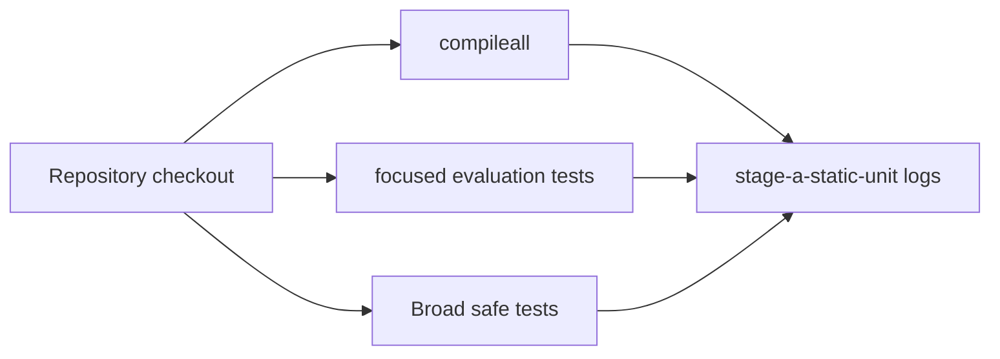
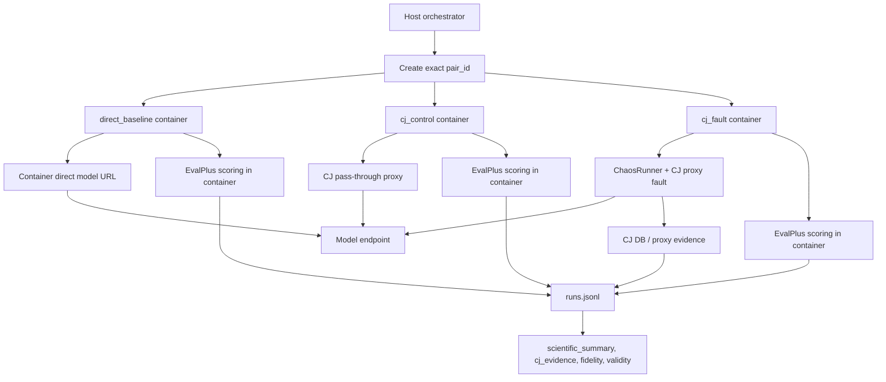
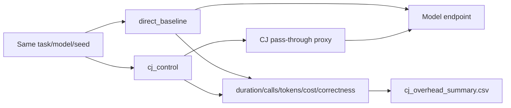
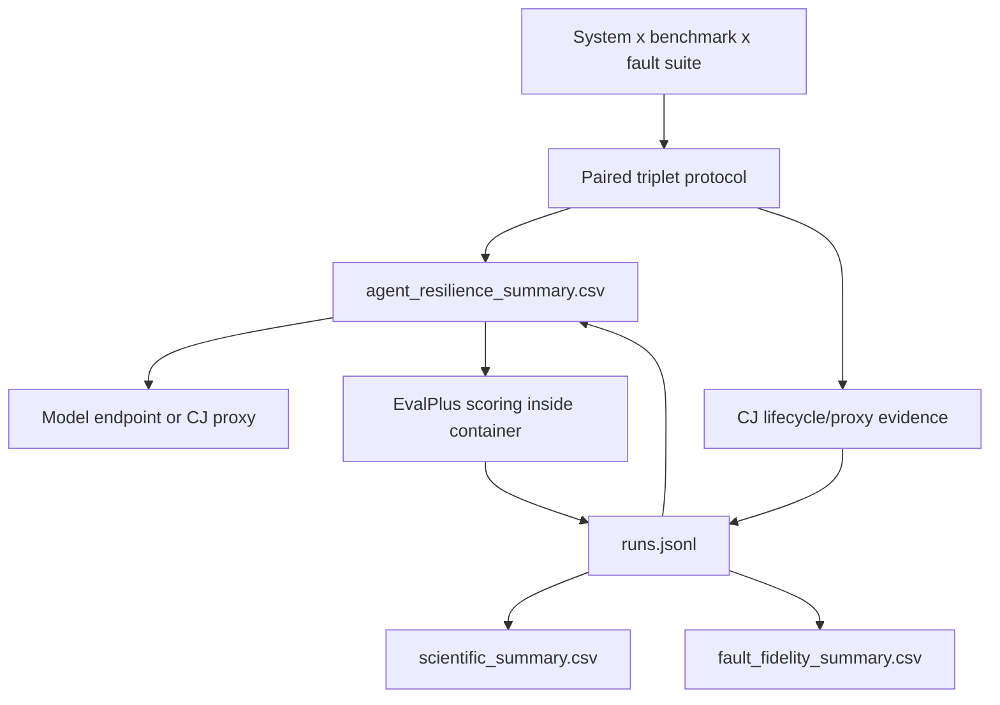
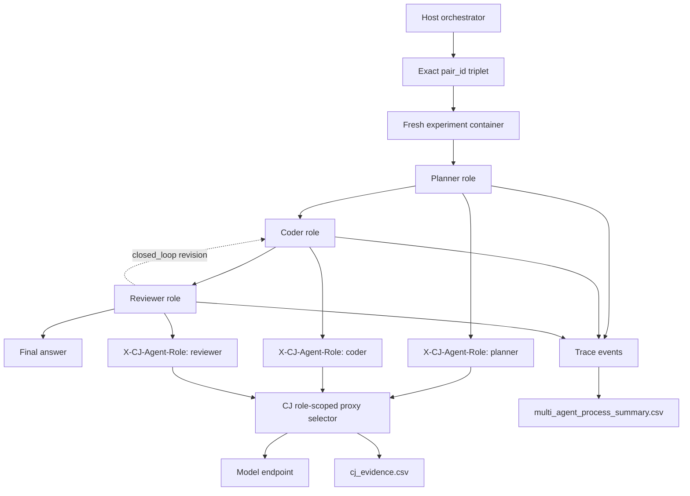
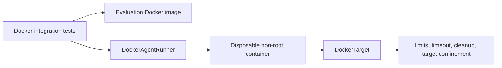

# Chaos Jungle Paper Experiment Scenarios

This document defines the paper-facing experiment families, their result-folder
layout, and their execution architecture. The scripts in `evaluation/scripts/`
are thin wrappers around the existing publication triplet protocol:

```text
direct_baseline, cj_control, cj_fault
```

Each run writes to a named category under:

```text
results/paper/<category>/<named-experiment>-<UTC timestamp>/
```

Every folder contains at least:

- `run_command.sh` or test command scripts;
- `logs/`;
- `runs.jsonl` for experiment runs;
- generated CSV/LaTeX/manifest outputs after the run completes.

## Script Inventory

| Script | Category Folder | Purpose |
| --- | --- | --- |
| `evaluation/scripts/run_static_validation.sh` | `stage-a-static-unit` | Compile checks, focused evaluation tests, broad non-Docker tests |
| `evaluation/scripts/run_docker_integration_tests.sh` | `stage-c-docker-integration` | Docker-marked integration tests |
| `evaluation/scripts/run_all_tests.sh` | validation categories | Static/unit tests plus optional Docker tests |
| `evaluation/scripts/run_injector_validation.sh` | `injector-validation` | CJ proxy fault activation/trigger/manifest/recovery validation |
| `evaluation/scripts/run_cj_overhead_study.sh` | `cj-overhead` | Direct baseline vs CJ-control overhead analysis |
| `evaluation/scripts/run_individual_resilience_pilot.sh` | `individual-resilience-pilot` | AutoGen/LangGraph/CrewAI individual-agent pilot |
| `evaluation/scripts/run_multi_agent_reference_pilot.sh` | `multi-agent-reference-pilot` | Framework-neutral three-role multi-agent pilot |
| `evaluation/scripts/run_all_paper_scenarios.sh` | multiple categories | Smoke or pilot wrapper |

Default model routing is set for local Ollama-compatible endpoints:

```bash
export CJ_EVAL_MODEL="${CJ_EVAL_MODEL:-qwen2.5:latest}"
export CJ_EVAL_BASE_URL="${CJ_EVAL_BASE_URL:-http://127.0.0.1:11434/v1}"
export CJ_EVAL_CONTAINER_BASE_URL="${CJ_EVAL_CONTAINER_BASE_URL:-http://host.docker.internal:11434/v1}"
export CJ_EVAL_API_KEY="${CJ_EVAL_API_KEY:-dummy}"
```

Override those variables for a cloud OpenAI-compatible endpoint. Do not pass API
keys as CLI arguments; use `.env`, `CJ_EVAL_ENV_FILE`, or process environment.

## Build Image

Build or refresh the Docker image before Docker experiments:

```bash
evaluation/docker/rebuild_image.sh --force-remove
```

To rebuild automatically inside an experiment script:

```bash
CJ_EVAL_REBUILD_IMAGE=1 evaluation/scripts/run_injector_validation.sh
```

## A. Static And Unit Validation

Goal: verify the code path before any paid or Docker campaign.

```bash
evaluation/scripts/run_static_validation.sh
```

Architecture:



This stage makes no model calls and does not claim fault-injection validity.

## B. CJ Injector Validation

Goal: prove CJ can accurately activate, trigger, manifest, revert, and recover
the connected proxy fault types. This is the correct category for the current
eight-fault smoke result.

```bash
evaluation/scripts/run_injector_validation.sh
```

Default faults:

```text
llm_timeout
llm_rate_limit
llm_unavailable
response_truncation
malformed_response
tool_failure
token_starvation
llm_latency
```

Architecture:



Scientific claim supported when valid: CJ injector validity and fidelity under
the tested configuration. Agent-resilience claims require baseline-successful
pairs and enough unique tasks.

## C. CJ Overhead

Goal: estimate CJ cost when no fault is active.

```bash
evaluation/scripts/run_cj_overhead_study.sh
```

Use `cj_overhead_summary.csv`, which compares only:

```text
direct_baseline vs cj_control
```

Architecture:



Confidence intervals are suppressed until there are enough unique tasks.

## D. Individual-Agent Resilience Pilot

Goal: measure how verified faults affect individual coding agents.

```bash
evaluation/scripts/run_individual_resilience_pilot.sh
```

Default matrix:

| Dimension | Default Values |
| --- | --- |
| Systems | `autogen-real`, `langgraph-real`, `crewai-real` |
| Benchmarks | `humanevalplus`, `mbppplus` |
| Fault suites | `llm_api`, `response`, `tool` |
| Conditions | direct baseline, CJ control, CJ fault |

Architecture:



Primary resilience effects must be computed only from valid fault pairs whose
direct baseline succeeded. If baselines fail, the run remains useful as injector
validation but not as resilience evidence.

## E. Multi-Agent Reference Pilot

Goal: study process-level propagation and repair in the current three-role
reference multi-agent workflow.

```bash
evaluation/scripts/run_multi_agent_reference_pilot.sh
```

Default topology values:

```text
linear
closed_loop
```

Default role-scoped fault suite:

```text
planner_llm_unavailable
reviewer_response_corrupt
coder_tool_fault
```

Architecture:



Important limitation: this is currently reported as `reference-multi-agent`.
It must not be described as native AutoGen, LangGraph, or CrewAI multi-agent
coordination until those framework-native workflows are implemented.

## F. Docker Infrastructure Validation

Goal: validate Docker execution and container-scoped fault safety.

```bash
evaluation/scripts/run_docker_integration_tests.sh
```

Architecture:



Publication infrastructure-fault campaigns require one more connection step:
`evaluation.infrastructure_orchestrator.run_container_scoped_fault` must be
invoked by the publication runner and flattened into the same `runs.jsonl`
schema. Until then, infrastructure faults are validated as implementation
components, not included in the main resilience-effect tables.

## Smoke Wrapper

Run a small smoke of all implemented paper categories:

```bash
evaluation/scripts/run_all_paper_scenarios.sh
```

Run all safe tests, with Docker tests opt-in:

```bash
evaluation/scripts/run_all_tests.sh
CJ_EVAL_RUN_DOCKER_TESTS=1 evaluation/scripts/run_all_tests.sh
```

Run the broader pilot defaults:

```bash
CJ_EVAL_PROFILE=pilot evaluation/scripts/run_all_paper_scenarios.sh
```

Optional Docker tests inside the wrapper:

```bash
CJ_EVAL_RUN_DOCKER_TESTS=1 evaluation/scripts/run_all_paper_scenarios.sh
```

## Folder Layout Example

```text
results/paper/
  stage-a-static-unit/
    static-validation-20261001T120000Z/
  injector-validation/
    qwen2.5-latest-all-proxy-faults-20261001T120000Z/
  cj-overhead/
    qwen2.5-latest-direct-vs-control-20261001T120000Z/
  individual-resilience-pilot/
    autogen-real-humanevalplus-llm_api-qwen2.5-latest-20261001T120000Z/
  multi-agent-reference-pilot/
    reference-linear-humanevalplus-multi_agent-qwen2.5-latest-20261001T120000Z/
```

## Paper Readiness Decision Rules

| Category | Paper Claim Allowed |
| --- | --- |
| Injector validation | CJ fault activation/manifestation/recovery fidelity |
| CJ overhead | Direct vs pass-through overhead, once enough unique tasks exist |
| Individual resilience | Only for valid, baseline-successful, complete triplets |
| Multi-agent reference | Reference MAS propagation/containment only |
| Infrastructure | Component validation until publication runner integration exists |
